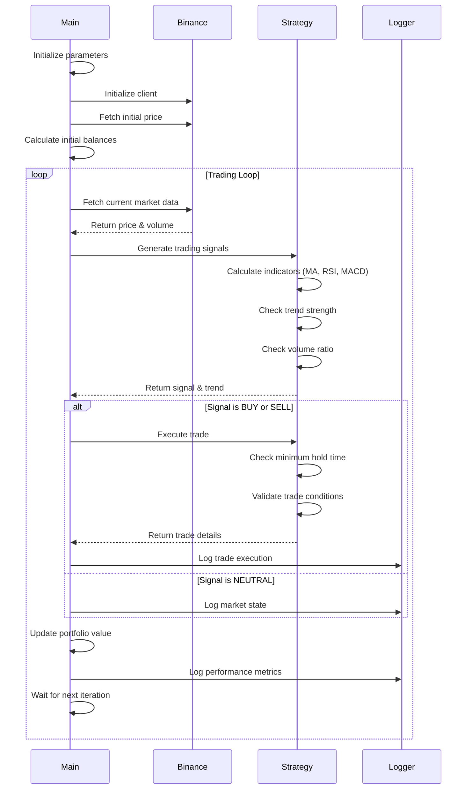
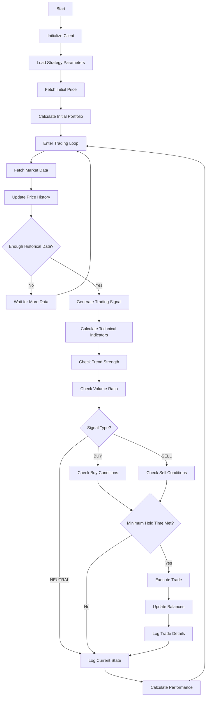

# Trend Detector v3 Documentation

## Overview
The Trend Detector v3 is an automated trading system that uses technical analysis indicators and machine learning to detect market trends and execute trades on the Binance exchange. The system is specifically designed to trade the TRUMP/USDC pair with enhanced risk management and multiple confirmation signals.

## System Architecture

### Sequence Diagram

### Flow Chart

## Key Components

1. **Initialization**
   - Load API credentials
   - Set initial strategy parameters
   - Calculate initial portfolio values

2. **Market Data Collection**
   - Fetch real-time price and volume data
   - Maintain historical price records
   - Calculate volume ratios

3. **Technical Analysis**
   - Moving Averages (Fast & Slow)
   - RSI (Relative Strength Index)
   - MACD (Moving Average Convergence Divergence)
   - Bollinger Bands
   - Trend Strength Indicators

4. **Trading Logic**
   - Signal generation based on multiple confirmations
   - Minimum hold time enforcement
   - Volume threshold validation
   - Trend strength confirmation

5. **Risk Management**
   - Stop Loss
   - Take Profit
   - Trade Risk Percentage
   - Minimum Trade Size

6. **Performance Tracking**
   - Portfolio value calculation
   - Profit/Loss tracking
   - Trade history logging
   - Performance metrics calculation

## Strategy Parameters

| Parameter | Default Value | Description |
|-----------|---------------|-------------|
| FAST_MA_PERIOD | 10 | Fast Moving Average period |
| SLOW_MA_PERIOD | 30 | Slow Moving Average period |
| RSI_PERIOD | 14 | RSI calculation period |
| RSI_OVERBOUGHT | 65 | RSI overbought threshold |
| RSI_OVERSOLD | 35 | RSI oversold threshold |
| MIN_HOLD_TIME_MINUTES | 1 | Minimum time between trades |
| VOLUME_THRESHOLD | 1.1 | Minimum volume multiplier |
| TREND_STRENGTH_THRESHOLD | 0.3 | Required trend strength |

## Trading Signals

The system generates trading signals based on the following conditions:

### Buy Signal
- Price is in downtrend
- RSI is oversold OR trend reversal detected
- Volume above threshold
- Strong trend confirmation
- Significant price movement
- MACD bullish confirmation

### Sell Signal
- Price is in uptrend
- RSI is overbought OR trend reversal detected
- Volume above threshold
- Strong trend confirmation
- Significant price movement
- MACD bearish confirmation

## Logging and Monitoring

The system maintains detailed logs of:
- Trade executions
- Portfolio performance
- Market conditions
- Technical indicators
- Trade statistics

## Error Handling

The system includes:
- Graceful shutdown handling
- API connection error recovery
- Market data validation
- Trade execution verification
- Balance update confirmation
