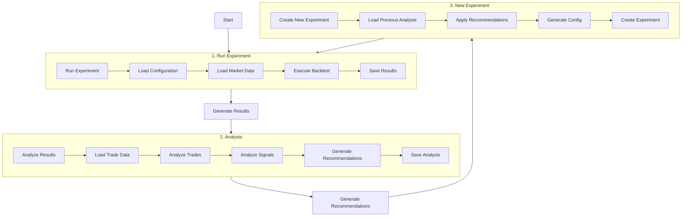

# Trading Strategy Parameter Simulation Workflow

This document describes the workflow for running trading strategy simulations, analyzing results, and generating new experiments with optimized parameters.

## Workflow Overview



## Detailed Steps

### 1. Run Experiment
```bash
python src/trend_detector_backtest.py --experiment simulations/experiments/vX
```
This step:
- Loads experiment configuration from `config.py`
- Processes market data
- Executes trading strategy
- Generates:
  - `detailed_log_[timestamp].jsonl`: Detailed trade and signal data
  - `results_[timestamp].json`: Summary results

### 2. Analyze Results
```bash
python simulations/analysis/analyze_experiment.py --experiment simulations/experiments/vX
```
This step:
- Loads the most recent experiment results
- Analyzes:
  - Trade performance
  - Signal effectiveness
  - Parameter impact
- Generates:
  - `analysis_[timestamp].json`: Analysis results and recommendations

### 3. Generate New Experiment
```bash
python simulations/analysis/experiment_generator.py --base-experiment simulations/experiments/vX --name vY
```
This step:
- Loads the most recent analysis
- Uses recommendations to set new parameters
- Creates new experiment configuration

## Directory Structure
```
simulations/
├── experiments/
│   ├── v1/
│   │   ├── config.py
│   │   └── results/
│   │       ├── detailed_log_[timestamp].jsonl
│   │       ├── results_[timestamp].json
│   │       └── analysis_[timestamp].json
│   ├── v2/
│   │   └── ...
│   └── v3/
│       └── ...
└── analysis/
    ├── analyze_experiment.py
    └── experiment_generator.py
```

## Key Files

### config.py
Contains experiment configuration:
- Trading parameters
- Experiment metadata
- Default values
- Parameter overrides

### detailed_log_[timestamp].jsonl
Contains detailed trade data:
- Entry/exit points
- Prices
- Indicators
- Signals

### results_[timestamp].json
Contains summary results:
- Total trades
- Win rate
- Returns
- Performance metrics

### analysis_[timestamp].json
Contains analysis and recommendations:
- Trade analysis
- Signal analysis
- Parameter recommendations
- Strategy improvements

## Workflow Example

1. Run initial experiment (v1):
```bash
python src/trend_detector_backtest.py --experiment simulations/experiments/v1
```

2. Analyze v1 results:
```bash
python simulations/analysis/analyze_experiment.py --experiment simulations/experiments/v1
```

3. Generate v2 based on v1 analysis:
```bash
python simulations/analysis/experiment_generator.py --base-experiment simulations/experiments/v1 --name v2
```

4. Run v2 experiment:
```bash
python src/trend_detector_backtest.py --experiment simulations/experiments/v2
```

And so on, creating an iterative optimization process.

## Notes

- Each experiment preserves its configuration and results
- Analysis is based on the most recent results in each experiment
- New experiments can be based on any previous experiment
- Parameters are optimized based on actual trading performance
- The workflow supports continuous strategy improvement 