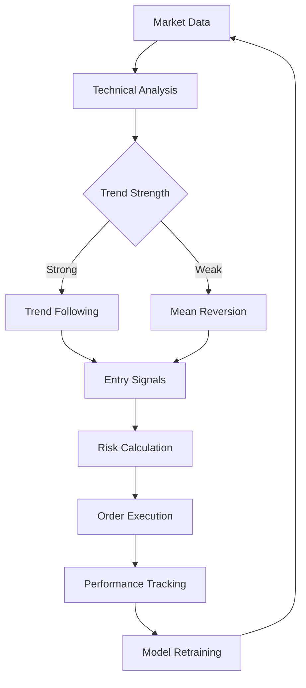

# Trend Detector v1 DeepSeek Pro

## Overview
An AI-powered trading system combining:
- 📈 Multi-timeframe technical analysis
- 🤖 Reinforcement learning adaptation
- 🛡️ Risk-managed position sizing
- 📊 Real-time performance monitoring

## Key Features
### Smart Trading Engine


### Core Components
1. **Adaptive Learning Core**
   - Self-optimizing threshold adjustment
   - Experience replay mechanism
   - Market regime detection

2. **Multi-Strategy Detection**
   - Trend-following (EMA crossover)
   - Mean reversion (Bollinger Bands)
   - Momentum confirmation (RSI + Volume)

3. **Risk Management System**
   - ATR-based position sizing
   - Dynamic stop-loss/take-profit
   - Circuit breakers

## Technical Indicators
| Indicator | Parameters | Purpose |
|-----------|------------|---------|
| EMA | 20, 50 periods | Trend direction |
| RSI | 14 periods | Momentum strength |
| ATR | 14 periods | Volatility measure |
| VWAP | - | Fair value price |
| ADX | 14 periods | Trend strength |
| MACD | 12/26/9 | Momentum shifts |

## Smart Features
### Reinforcement Learning Model
```python
class TradingModel:
    def predict_threshold(self, market_state):
        if not hasattr(self.model, "coef_"):
            return random_threshold
        return model.predict(market_state)
    
    def update_model(self, reward):
        self.model.partial_fit(new_data)
```

### Trading Signals
```python
{
    "signal": "BUY", 
    "confidence": 85.5,
    "stop_loss": 25.50,
    "take_profit": 27.80,
    "position_size": 235.50,
    "risk_reward": 2.0
}
```

## User Experience
### Real-Time Monitoring
```bash
[2024-03-15 14:30:01] 🚨 ALERT: Strong uptrend detected (EMA20 > EMA50)
[2024-03-15 14:30:02] 🔄 Model Update: Threshold adjusted 1.2 → 1.15
[2024-03-15 14:30:03] 🟢 EXECUTE: Buy 0.45 BTC @ $26,500
[2024-03-15 14:30:04] 🛡️ Risk Parameters: SL $25,800 | TP $27,200
```

### Safety Features
1. Balance protection (never risk >2%)
2. Minimum trade amount ($1.50)
3. Volatility circuit breakers
4. API error handling

## Advanced Configuration
```python
class SmartTrendDetector:
    def __init__(self,
        risk_per_trade=0.02,  # 2% account risk
        atr_multiplier=3,
        rsi_window=14,
        ema_short=20,
        ema_long=50):
```

| Parameter | Default | Range | Description |
|-----------|---------|-------|-------------|
| risk_per_trade | 0.02 | 0.01-0.05 | Account risk per trade |
| atr_multiplier | 3 | 2-4 | Stop-loss distance |
| rsi_window | 14 | 7-21 | Momentum sensitivity |
| ema_short | 20 | 10-50 | Fast trend period |
| ema_long | 50 | 30-100 | Slow trend period |

## Installation & Usage
```bash
# Install with ML dependencies
pip install -r requirements.txt

# Run with custom parameters
python src/trend_detector_v1_deepseek.py \
    --symbol TRUMPUSDC \
    --risk 0.03 \
    --atr-multiplier 3.5 \
    --rsi-period 10
```

## Performance Metrics
| Metric | Calculation | Target |
|--------|-------------|--------|
| Win Rate | Wins / Total Trades | >55% |
| Risk/Reward | Avg Profit / Avg Loss | >1.5 |
| Sharpe Ratio | Risk-adjusted Returns | >1.0 |
| Max Drawdown | Peak-to-Trough Decline | <15% |
| Profit Factor | Gross Profit / Gross Loss | >1.2 |
