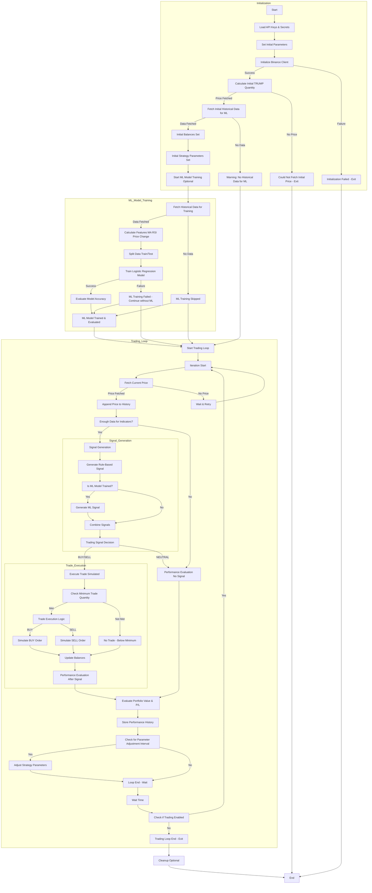

# Trend Detector v1 Gemini - Self-Learning Trading System for Binance

This document describes the `trend_detector_v1_gemini.py` script, a self-learning cryptocurrency trading system designed to simulate trading on Binance. It is built for end-users who want an automated trading solution that optimizes itself over time without requiring manual parameter adjustments.

## Overview

The Trend Detector v1 Gemini system uses a combination of technical indicators and a self-learning mechanism to make trading decisions for the TRUMP/USDC pair on Binance. It starts with an initial capital of 500 USDC and 500 USDC worth of TRUMP coins. The system continuously monitors the market, generates trading signals, executes simulated trades, and adjusts its trading strategy based on its performance.

**Key Features:**

*   **Self-Learning:** The system automatically adjusts its trading parameters based on past performance, aiming to optimize profitability over time.
*   **Technical Indicators:** It uses Moving Averages (MA) and Relative Strength Index (RSI) to identify potential trading opportunities.
*   **Simulated Trading:** The script simulates trading using the Binance API to fetch real-time market data but does not execute real trades (in this version). You can adapt it for real trading by implementing actual order placement using the Binance SDK. **Use with caution and at your own risk for real trading.**
*   **Automated Operation:** Once started, the system runs continuously, making trading decisions without manual intervention.
*   **Parameter Optimization:** The system starts with default parameters and iteratively refines them to improve trading performance.
*   **Risk Management:** Includes basic risk management with a minimum trade size and parameter adjustments to become more conservative during poor performance.

## Trend Detector Script Logic Flow

This section describes the logical flow of the `trend_detector_v1_gemini.py` script to help understand its inner workings.



The flowchart above illustrates the following steps:

1.  **Start Script**: The script execution begins.
2.  **Load Configuration**:  The script loads configurations from a file or environment variables, including data source details and trend detection method.
3.  **Check Data Source**: The script determines the source of the time series data (e.g., CSV file or InfluxDB).
4.  **Read Data**: Based on the data source, the script reads data either from a CSV file or by querying InfluxDB.
5.  **Data Preprocessing**: The loaded data is preprocessed, which might include cleaning, formatting, and handling missing values.
6.  **Select Trend Detection Method**: The script chooses a trend detection method based on the configuration (e.g., Simple Moving Average or Linear Regression).
7.  **Apply Trend Detection Method**: The selected method is applied to the preprocessed data to identify trends.
8.  **Analyze Trend Results**: The results from the trend detection method are analyzed to determine the presence and characteristics of trends.
9.  **Output Trend Report**: A report summarizing the detected trends is generated.
10. **Display/Save Report**: The report is either displayed to the user or saved to a file, depending on the script's configuration.
11. **End Script**: The script execution completes.

This visual representation should provide a clearer understanding of the script's logic and decision-making process.

## Strategy

The trading strategy is based on the following technical indicators:

1.  **Moving Averages (MA):**
    *   **Fast Moving Average:**  A shorter period MA to identify short-term trends.
    *   **Slow Moving Average:** A longer period MA to identify longer-term trends.
    *   **Crossover Strategy:**  A "BUY" signal is generated when the fast MA crosses above the slow MA, indicating a potential upward trend. A "SELL" signal is generated when the fast MA crosses below the slow MA, indicating a potential downward trend.

2.  **Relative Strength Index (RSI):**
    *   **RSI Period:**  Used to calculate the RSI, which measures the magnitude of recent price changes to evaluate overbought or oversold conditions.
    *   **Overbought/Oversold Levels:**
        *   **Overbought:**  When RSI exceeds a certain level (e.g., 70), it suggests the asset may be overvalued and prone to a price decrease.
        *   **Oversold:**  When RSI falls below a certain level (e.g., 30), it suggests the asset may be undervalued and prone to a price increase.

**Trading Signal Generation:**

*   **BUY Signal:** Generated when the fast MA is above the slow MA AND the RSI is below the oversold level.
*   **SELL Signal:** Generated when the fast MA is below the slow MA AND the RSI is above the overbought level.
*   **NEUTRAL Signal:** In all other conditions, no trade is executed.

**Self-Learning Mechanism:**

The system evaluates its performance periodically (every 10 iterations in the current script) and adjusts its trading parameters based on the average profit/loss percentage over the recent period.

*   **Improved Performance (Profit > 0.5% average):** The system becomes more exploratory by:
    *   Decreasing the fast MA period (making it more sensitive to short-term changes).
    *   Increasing the RSI overbought level and decreasing the oversold level (widening the neutral RSI range).

*   **Poor Performance (Loss < -1.0% average):** The system becomes more conservative by:
    *   Increasing the slow MA period (making it less sensitive to short-term fluctuations).
    *   Decreasing the RSI overbought level and increasing the oversold level (narrowing the neutral RSI range).
    *   Widening the stop-loss percentage.

*   **Moderate Performance:** Minor adjustments are made to fine-tune the parameters.

**Initial Parameters:**

The script starts with the following initial parameters, which are then adjusted by the self-learning mechanism:

*   `FAST_MA_PERIOD = 12`
*   `SLOW_MA_PERIOD = 26`
*   `RSI_PERIOD = 14`
*   `RSI_OVERBOUGHT = 70`
*   `RSI_OVERSOLD = 30`
*   `STOP_LOSS_PERCENT = 0.05`
*   `TAKE_PROFIT_PERCENT = 0.10`

## How to Use

1.  **Install Binance Python SDK:**
    ```bash
    pip install python-binance
    ```

2.  **Set up Binance API Keys:**
    *   Create API keys on your Binance account ([https://www.binance.com/en/my/settings/api-management](https://www.binance.com/en/my/settings/api-management)).
    *   **Important:** For simulated trading and testing, consider using the Binance Testnet API if you want to avoid any risk to your real funds. However, this script in its current form is designed for simulation using live data, not testnet. To use real trading, you would need to modify the `execute_trade` function to place actual orders. **Be extremely cautious when connecting to the real Binance API and trading with real funds.**
    *   Set environment variables `binance_api` and `binance_secret` with your API key and secret. For example, in your `.bashrc` or `.zshrc`:
        ```bash
        export binance_api="YOUR_API_KEY"
        export binance_secret="YOUR_API_SECRET"
        ```
        Replace `YOUR_API_KEY` and `YOUR_API_SECRET` with your actual API key and secret.

3.  **Run the Script:**
    ```bash
    python src/trend_detector_v1_gemini.py
    ```

4.  **Monitor the Output:** The script will print the trading process, including:
    *   Current price of TRUMP/USDC
    *   Trading signals (BUY, SELL, NEUTRAL)
    *   Simulated trade executions
    *   USDC and TRUMP balances
    *   Portfolio value and profit/loss percentage
    *   Adjustments to strategy parameters

## Risk Disclaimer

**This script is for educational and simulation purposes only.** Trading cryptocurrency involves significant risk of loss.

*   **Simulated Trading:** This script simulates trades and does not execute real orders on Binance in its current form. To use it for real trading, you would need to modify the `execute_trade` function to place actual orders using the Binance API.
*   **No Financial Advice:** This script and documentation are not financial advice.
*   **Use at Your Own Risk:** If you decide to trade with real funds, start with a very small amount and thoroughly test and understand the system before increasing your investment.
*   **API Security:** Protect your Binance API keys and secrets. Do not share them and ensure they are securely stored as environment variables or in a secure configuration.

## Further Improvements

*   **More Sophisticated Strategies:** Implement more advanced trading strategies, such as:
    *   Adding more technical indicators (e.g., MACD, Bollinger Bands).
    *   Using more complex signal combinations and conditions.
    *   Incorporating order book data or other market information.
*   **Advanced Self-Learning:**
    *   Implement more sophisticated optimization algorithms (e.g., gradient descent, genetic algorithms) for parameter tuning.
    *   Explore reinforcement learning techniques to train the trading strategy.
*   **Risk Management Enhancements:**
    *   Implement stop-loss and take-profit orders in the simulated trades. (Basic stop-loss/take-profit percentages are included, but not order execution logic).
    *   Dynamically adjust trade size based on risk and portfolio value.
*   **Backtesting:**
    *   Incorporate backtesting functionality to evaluate strategy performance on historical data.
*   **User Interface:**
    *   Develop a user interface (e.g., web-based or command-line) to monitor the system and configure parameters.
*   **Real Trading Implementation:**
    *   Implement the actual order placement logic using the Binance API to enable real trading (with extreme caution and thorough testing).
*   **Error Handling and Logging:**
    *   Improve error handling and implement more comprehensive logging for debugging and monitoring.
*   **Parameter Tuning Range Limits:**
    *   Add limits to the parameter tuning ranges to prevent parameters from going to extreme or unrealistic values.

This documentation provides a comprehensive guide to understanding and using the Trend Detector v1 Gemini system. Remember to use it responsibly and understand the risks involved in cryptocurrency trading. 