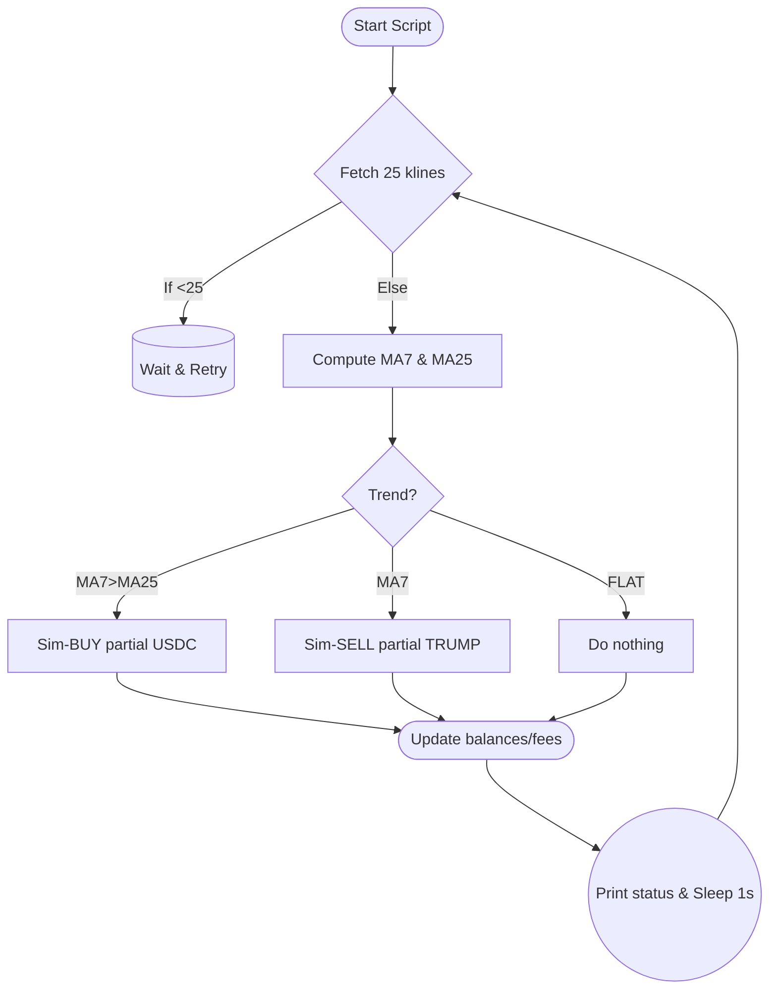

# Trend Detector v1 – Strategy Overview

This document explains the simple strategy implemented in trend_detector_v1.py, which operates in a purely simulated manner – no real orders are placed on Binance.

## Key Points

1. Fetch Market Data:  
   - Every second, the script fetches the latest candlesticks (klines) for TRUMPUSDC from Binance.  
   - By default, we fetch 25 candlesticks (1-minute interval).

2. Determine Trend:  
   - We compute a 7-candle moving average (MA7) and a 25-candle moving average (MA25).  
   - If MA7 > MA25, we consider the market to be in an "UP" trend.  
   - If MA7 < MA25, we consider the market to be in a "DOWN" trend.  
   - Otherwise, we mark it as "FLAT."

3. Initial Virtual Capital:  
   - The script starts with 10 USDC and 0 TRUMP (no holdings).  
   - When our strategy "buys," we spend some or all of this 10 USDC for TRUMP.  
   - When we "sell," we convert TRUMP back into USDC.

4. Transaction Fee (0.1%):  
   - Each time we simulate a trade (BUY or SELL), we deduct a 0.1% fee from the transaction value to emulate real exchange costs.  
   - For example, if we buy 5 USDC worth of TRUMP, we pay an extra 0.1% of that 5 USDC = 0.005 USDC as a fee.

5. Basic Logic for Virtual Trades:  
   - If the trend is "DOWN" and we have free USDC, we place a simulated BUY for 10 USDC (or the maximum available if we had partial leftover assets).  
   - If the trend is "UP" and we hold TRUMP, we attempt to SELL all of it for a +1% margin above our last buy price.  
     - If the price is not yet at +1% over the last buy, we can optionally wait or place the sell anyway. In this simple example, we place a SELL and track the net result.  
     - Each SELL includes the 0.1% fee.  
   - We keep track of each trade's outcome and compute total net profit or loss in USDC.

6. Output:  
   - The console prints the computed MA7, MA25, and the resulting "UP" or "DOWN" trend.  
   - If a simulated BUY or SELL occurs, it is logged along with size, price, and resulting capital.  
   - The script continues until you manually stop it (Ctrl+C).

7. Future refinements:  
   - Wait for a clearly established trend (e.g., multiple consecutive "UP" intervals) before buying, and similarly for "DOWN."  
   - Incorporate a ring buffer or more advanced indicators (e.g., RSI, MACD) for better detection of short-term swings.

## Python Standard Library Usage
This script relies on Python's built-in libraries (time, math, argparse) and the official python-binance client. There is no use of undocumented or unsupported Python functionality. Everything follows mainstream libraries and standard language features.

## AI Integration Possibility
You could incorporate an AI-based approach (for example, via OpenRouter or an external API) to refine your trade decisions. For instance, at each polling interval:
1. Gather market data, compute MAs, fetch the current price.  
2. Call an AI model (e.g., GPT endpoint or an open-source LLM) with your current portfolio status to get a recommendation ("BUY," "SELL," or "HOLD").  
3. Place a simulated order based on that recommendation.  
  
This approach can be significantly more dynamic, but requires carefully handling rate limits and ensuring robust prompt engineering.

## Flowchart 
Below is a Mermaid flowchart outlining the typical logic flow in trend_detector_v1.py:

-------------------------------------------------------------------------------- 