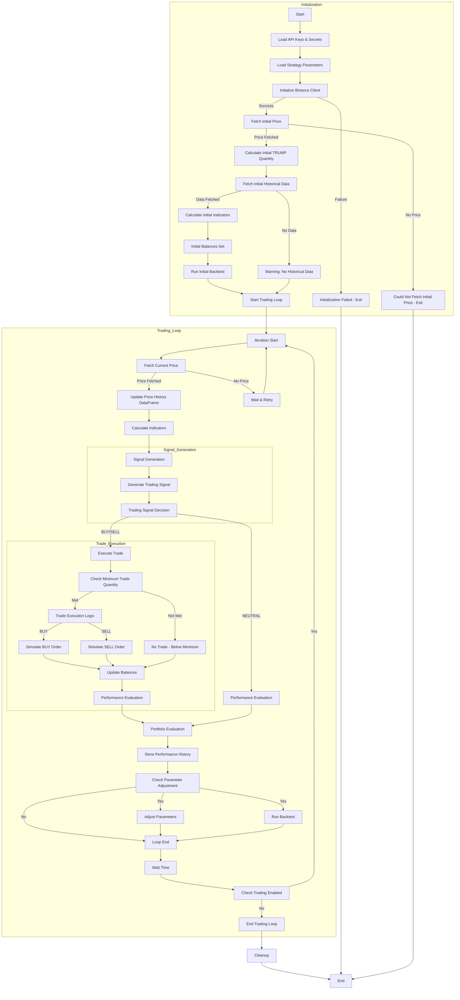

# Trend Detector v2 Gemini - Advanced Self-Learning Trading System for Binance

This document describes the `trend_detector_v2_gemini.py` script, an **advanced** self-learning cryptocurrency trading system designed to simulate trading on Binance. This version significantly improves upon `v1` by incorporating more sophisticated trading strategies, risk management, and backtesting capabilities. It is built for users who seek a more robust and adaptable automated trading simulation.

## Overview

Trend Detector v2 Gemini builds upon the foundation of v1, enhancing the trading logic with a broader range of technical indicators and a more dynamic approach to trade sizing and risk management. It continues to be a self-learning system, automatically adjusting its parameters based on performance, but now with a more complex strategy at its core.

**Key Improvements over v1:**

*   **Enhanced Technical Analysis:**  Utilizes **four** key technical indicators, a significant upgrade from v1's two:
    *   Moving Averages (MA) - Fast and Slow
    *   Relative Strength Index (RSI)
    *   Moving Average Convergence Divergence (MACD) - **New in v2**
    *   Bollinger Bands - **New in v2**
*   **Sophisticated Signal Generation:** Combines signals from all **four** indicators for more informed trading decisions, using a rule-based system that requires **confluence** among indicators. This is a more robust approach compared to v1's simpler signal logic.
*   **Dynamic Trade Sizing:** Implements trade sizing that dynamically adjusts the quantity of each trade based on the portfolio value and a user-defined risk percentage per trade (**`TRADE_RISK_PERCENT` parameter, new in v2**). This helps manage risk more effectively and scale trades with portfolio growth, a feature not present in v1.
*   **Integrated Stop-Loss and Take-Profit:** Simulates stop-loss and take-profit orders for each BUY trade (**`STOP_LOSS_PERCENT` and `TAKE_PROFIT_PERCENT` parameters, improved in v2**), enhancing risk management and profit-taking. v1 had basic stop-loss, v2 expands on this with take-profit and more configurable stop-loss.
*   **Backtesting Capability:** Includes a backtesting function to evaluate the strategy's performance on historical data. Backtests are run at startup and periodically to assess and optimize strategy parameters. **Backtesting is a completely new feature in v2, not available in v1.**
*   **Improved Parameter Adjustment:** The self-learning mechanism now adjusts a wider range of strategy parameters, including those related to **MACD and Bollinger Bands (new parameters in v2)**, for more comprehensive optimization. v1 focused on MA and RSI parameters.
*   **Data Management with Pandas:** Uses Pandas DataFrames to efficiently manage and process historical price data and indicator calculations. **Pandas DataFrames significantly improve data handling efficiency compared to v1's list-based approach.**

**Still Simulated Trading:** Like v1, this script simulates trading using the Binance API to fetch real-time market data but does not execute real trades in this version.  **Use with extreme caution and at your own risk if you adapt it for real trading.**

## Trend Detector v2 Script Logic Flow

The script logic flow is **more complex than v1** due to the added indicators and backtesting, but follows a similar iterative structure.

The flowchart illustrates the enhanced logic, including the calculation of multiple indicators, more complex signal generation, dynamic trade execution with risk management, and periodic backtesting.

## Strategy Parameters

Trend Detector v2 uses a wider set of strategy parameters compared to v1, allowing for finer control over the trading strategy and self-learning process. These parameters are initialized with default values but are adjusted by the script's self-learning mechanism over time.

Here's a detailed explanation of each parameter:

*   **`FAST_MA_PERIOD`**:  Period for the Fast Moving Average.  **Default: 12**.  A shorter period MA reacts quicker to price changes.  **Improved from v1, default increased from 5 to 12 for potentially smoother signals.**
*   **`SLOW_MA_PERIOD`**: Period for the Slow Moving Average. **Default: 26**. A longer period MA is less sensitive to short-term fluctuations and represents a longer-term trend. **Improved from v1, default increased from 20 to 26 for potentially more stable trend identification.**
*   **`RSI_PERIOD`**: Period for calculating the Relative Strength Index (RSI). **Default: 14**.  RSI measures the magnitude of recent price changes to evaluate overbought or oversold conditions. **Same as v1.**
*   **`RSI_OVERBOUGHT`**: RSI level considered overbought. **Default: 70**. When RSI exceeds this level, it may signal a potential price reversal downwards. **Same as v1.**
*   **`RSI_OVERSOLD`**: RSI level considered oversold. **Default: 30**. When RSI falls below this level, it may signal a potential price reversal upwards. **Same as v1.**
*   **`MACD_FAST_PERIOD`**: Fast period for MACD (Moving Average Convergence Divergence) calculation. **Default: 12**. MACD is a trend-following momentum indicator that shows the relationship between two moving averages of prices. **New in v2.**
*   **`MACD_SLOW_PERIOD`**: Slow period for MACD calculation. **Default: 26**. **New in v2.**
*   **`MACD_SIGNAL_PERIOD`**: Period for the MACD signal line calculation. **Default: 9**. The signal line is an EMA of the MACD line itself. **New in v2.**
*   **`BOLLINGER_BAND_PERIOD`**: Period for Bollinger Bands calculation. **Default: 20**. Bollinger Bands are volatility bands placed above and below a moving average. **New in v2.**
*   **`BOLLINGER_BAND_STD`**: Number of standard deviations for Bollinger Bands. **Default: 2**. Determines the width of the bands. **New in v2.**
*   **`STOP_LOSS_PERCENT`**: Percentage below the entry price to set a stop-loss order. **Default: 0.02 (2%)**.  A risk management tool to limit potential losses on a trade. **Improved in v2, default increased from 0.001 (0.1%) to 0.02 (2%) for more practical risk management.**
*   **`TAKE_PROFIT_PERCENT`**: Percentage above the entry price to set a take-profit order. **Default: 0.10 (10%)**.  A profit-taking tool to secure gains when the price moves favorably. **New in v2.**
*   **`TRADE_RISK_PERCENT`**: Percentage of the portfolio value to risk on each trade. **Default: 0.01 (1%)**.  Determines the dynamic trade size based on portfolio value. **New in v2.**

## Trading Strategy - Combined Indicators

Trend Detector v2 employs a more sophisticated trading strategy that combines signals from **four** technical indicators: Moving Averages, RSI, MACD, and Bollinger Bands. This combined approach aims to increase signal reliability and filter out false signals compared to v1's simpler MA and RSI strategy.

**Signal Generation Logic:**

The `generate_trading_signal()` function now evaluates conditions from all four indicators to generate trading signals.  A **BUY** or **SELL** signal is generated only when there is a **confluence** of signals suggesting a potential trading opportunity.

*   **BUY Signal Conditions:** A **BUY** signal is generated when **all** of the following conditions are met:
    1.  **Moving Average Crossover:** The Fast Moving Average (`FAST_MA`) crosses above the Slow Moving Average (`SLOW_MA`), indicating a potential upward trend.
    2.  **RSI Oversold:** The RSI value is below the `RSI_OVERSOLD` level, suggesting the asset may be undervalued and poised for a price increase.
    3.  **MACD Crossover:** The MACD line crosses above the MACD Signal line, indicating bullish momentum.
    4.  **Bollinger Bands - Price Below Lower Band:** The current price touches or goes slightly below the lower Bollinger Band, suggesting a potential bounce back upwards.

*   **SELL Signal Conditions:** A **SELL** signal is generated when **all** of the following conditions are met:
    1.  **Moving Average Crossover:** The Fast Moving Average (`FAST_MA`) crosses below the Slow Moving Average (`SLOW_MA`), indicating a potential downward trend.
    2.  **RSI Overbought:** The RSI value is above the `RSI_OVERBOUGHT` level, suggesting the asset may be overvalued and poised for a price decrease.
    3.  **MACD Crossover:** The MACD line crosses below the MACD Signal line, indicating bearish momentum.
    4.  **Bollinger Bands - Price Above Upper Band:** The current price touches or goes slightly above the upper Bollinger Band, suggesting a potential pullback downwards.

*   **NEUTRAL Signal:** If **any** of the conditions for BUY or SELL are not met, the signal is **NEUTRAL**, and no trade is executed.

This **confluence-based signal logic** is a significant improvement over v1. By requiring confirmation from multiple indicators, v2 aims to reduce the number of false signals and increase the probability of successful trades. However, it may also result in fewer trading opportunities compared to v1, as the conditions for signal generation are more stringent.

## Dynamic Trade Sizing and Risk Management

Trend Detector v2 introduces **dynamic trade sizing** and enhanced risk management features, which were not present in v1.

*   **Dynamic Trade Sizing (`TRADE_RISK_PERCENT`):**
    *   Instead of trading a fixed quantity, v2 calculates the trade quantity dynamically based on the current portfolio value and the `TRADE_RISK_PERCENT` parameter.
    *   The script calculates the amount of USDC to risk on each trade as: `portfolio_value * TRADE_RISK_PERCENT`.
    *   This risked amount is then used to determine the quantity of TRUMP to buy or sell, ensuring that the risk per trade is a consistent percentage of the portfolio.
    *   **Example:** If the portfolio value is 1000 USDC and `TRADE_RISK_PERCENT` is 0.01 (1%), the script will risk 10 USDC per trade. If the current price of TRUMP is $50, it will attempt to buy or sell approximately 10/50 = 0.2 TRUMP.
    *   Dynamic trade sizing allows the system to scale its trade sizes as the portfolio grows or shrinks, which is a more sophisticated approach to risk management and capital allocation than v1's fixed quantity approach.

*   **Stop-Loss and Take-Profit Orders (`STOP_LOSS_PERCENT`, `TAKE_PROFIT_PERCENT`):**
    *   For every **BUY** trade, v2 now simulates both stop-loss and take-profit orders.
    *   **Stop-Loss:** A stop-loss order is simulated at a price level `STOP_LOSS_PERCENT` below the entry price. If the price reaches this level, the script simulates selling the position to limit losses. **The default `STOP_LOSS_PERCENT` is increased to 2% in v2 for more realistic risk management.**
    *   **Take-Profit:** A take-profit order is simulated at a price level `TAKE_PROFIT_PERCENT` above the entry price. If the price reaches this level, the script simulates selling the position to secure profits. **Take-profit is a new feature in v2, not present in v1.** **Default `TAKE_PROFIT_PERCENT` is 10%.**
    *   These simulated stop-loss and take-profit orders add a layer of automated risk and profit management to the trading strategy, which was lacking in v1.

## Backtesting

**Backtesting is a major new feature in Trend Detector v2, not available in v1.**  It allows you to evaluate the performance of the trading strategy on historical data.

*   **`backtest_strategy()` Function:**
    *   The script includes a `backtest_strategy()` function that simulates trading over a historical price dataset using the current strategy parameters.
    *   This function processes historical price data point by point, generates trading signals based on the strategy logic, and simulates trade executions (BUY/SELL) as if the strategy were trading live during that historical period.
    *   It calculates performance metrics such as total profit/loss, number of trades, and final portfolio value based on the backtesting simulation.

*   **Initial Backtest at Startup:**
    *   When the script starts, it fetches historical data and runs an initial backtest using the default strategy parameters.
    *   This provides an initial indication of how the strategy might have performed in the past with the default settings.

*   **Periodic Backtesting with Adjusted Parameters:**
    *   Every 10 iterations, after the strategy parameters are adjusted by the self-learning mechanism, the script runs another backtest using the *newly adjusted* parameters.
    *   This allows you to see how the parameter adjustments are potentially impacting the strategy's historical performance and whether the self-learning is leading to improvements.

*   **Backtest Output:**
    *   The backtesting results are printed in the console output, including:
        *   Performance percentage over the backtesting period.
        *   Total number of trades executed during the backtest.

Backtesting is a valuable tool for strategy development and evaluation. It helps to:

*   **Assess Strategy Viability:** Get an idea of how the strategy might perform under different market conditions based on past data.
*   **Optimize Parameters:** Evaluate the impact of different parameter settings on historical performance, aiding in the parameter adjustment process.
*   **Identify Potential Issues:** Uncover potential weaknesses or flaws in the strategy logic by observing its behavior on historical data.

**Important Note:** Backtesting results are not a guarantee of future performance. Past performance is not indicative of future results. Backtesting is a simulation based on historical data, and real-world trading involves many factors that cannot be perfectly replicated in a backtest. However, backtesting provides valuable insights for strategy refinement and risk assessment.

## Risk Disclaimer

**Trend Detector v2 Gemini is for educational and simulation purposes only.** Cryptocurrency trading is highly risky.

*   **Simulated Trading:** This script simulates trading and does not execute real orders. Modifying it for real trading involves substantial risk.
*   **Enhanced Risk Management Features in v2:** While v2 includes improved risk management features like dynamic trade sizing and stop-loss/take-profit, these are still simulated and may not fully protect against losses in real trading.
*   **No Financial Advice:** This is not financial advice. Understand the risks before trading.
*   **Use at Your Own Risk:** If trading with real funds, start very small and test thoroughly.
*   **API Key Security:** Secure your API keys.

## Further Improvements - v3 and Beyond

Trend Detector v2 provides a significant step forward. Potential future enhancements include:

*   **Refined Signal Logic:**
    *   Explore more complex conditions and weights for combining indicator signals. **Consider weighting the confluence of indicators differently based on their individual reliability or market conditions.**
    *   Incorporate volume analysis and order book data for signal confirmation. **Volume confirmation could be particularly useful for validating signals from MACD and Bollinger Bands.**
    *   Test different indicator periods and parameters for optimization. **Explore a wider range of parameter combinations and potentially use optimization algorithms to find optimal settings.**
*   **Advanced Self-Learning and Optimization:**
    *   Implement more sophisticated optimization algorithms (e.g., genetic algorithms, reinforcement learning) for parameter tuning and strategy adaptation. **Consider reinforcement learning to dynamically adapt strategy parameters based on real-time market feedback.**
    *   Dynamically adjust `TRADE_RISK_PERCENT` based on market volatility and strategy performance. **Implement a volatility measure (e.g., Average True Range - ATR) to adjust `TRADE_RISK_PERCENT` and trade size based on market conditions.**
*   **Enhanced Risk Management:**
    *   Implement trailing stop-loss orders. **Trailing stop-loss can dynamically adjust the stop-loss level to lock in profits as the price moves favorably.**
    *   Incorporate portfolio-level risk management strategies. **Consider diversification or hedging strategies at the portfolio level to manage overall risk.**
*   **Improved Backtesting and Validation:**
    *   Expand backtesting to include walk-forward testing and out-of-sample validation. **Walk-forward testing provides a more realistic assessment of strategy performance by simulating forward optimization.**
    *   Develop more detailed backtesting reports and performance metrics. **Include metrics like Sharpe Ratio, Sortino Ratio, Maximum Drawdown, and win rate in backtesting reports for a more comprehensive performance analysis.**
*   **User Interface and Monitoring:**
    *   Create a user-friendly interface for monitoring, configuration, and performance analysis. **A web-based or desktop UI would significantly improve usability and monitoring capabilities.**
*   **Real-Time Order Execution:**
    *   Implement real order execution capabilities for live trading (with extreme caution and rigorous testing in a simulated environment first). **Real-time order execution would be the ultimate goal for a live trading system, but requires extensive testing and risk management.**
*   **Machine Learning Integration:**
    *   Explore more advanced machine learning models to predict market trends and generate trading signals, potentially replacing or augmenting the rule-based system. **Experiment with deep learning models or ensemble methods for potentially more accurate and adaptive signal generation.**

Trend Detector v2 Gemini offers a significantly more advanced platform for learning about automated trading strategies and self-optimization in cryptocurrency markets compared to v1. Use it responsibly and continue to explore and refine your understanding of trading and risk management.

## Data Fetching and Processing

Trend Detector v2, similar to v1, fetches market data from Binance in two main stages: **Initialization** and during each **Iteration** of the trading loop. However, v2 manages and processes this data **much more efficiently and effectively** using Pandas DataFrames and the `pandas-ta` library for technical indicators.

### 1. Initialization Data Fetching

*   **Fetching Current Price:**
    *   `fetch_current_price()` is called to get the real-time price of `TRUMPUSDC`.
    *   Used to calculate the initial `TRUMP` quantity.

*   **Fetching Historical Data:**
    *   `fetch_historical_data(interval=Client.KLINE_INTERVAL_1HOUR, limit=2000)` fetches historical candlestick data for `TRUMPUSDC`.
    *   Data is stored in a Pandas DataFrame `prices_history` with 'timestamp' and 'close' columns.
    *   This historical data is used for:
        *   Calculating initial technical indicators (MA, RSI, MACD, Bollinger Bands).
        *   Performing initial backtesting to evaluate strategy performance with default parameters.

### 2. Iteration Data Fetching (Trading Loop)

*   **Fetch Current Price (Per Iteration):**
    *   In each iteration, `fetch_current_price()` fetches the latest price of `TRUMPUSDC`.
    *   This current price is crucial for:
        *   Real-time signal generation.
        *   Simulated trade execution at the current market price.
        *   Updating portfolio value and performance metrics.

### 3. Data Processing in Trading Loop Iterations (Pandas DataFrame & `pandas-ta`)

*   **Update `prices_history` DataFrame:**
    *   The fetched `current_price` and its timestamp are added as a new row to the `prices_history` DataFrame.
    *   DataFrame is kept sorted by timestamp and duplicates are removed to maintain clean, chronological price data. **Pandas DataFrames provide efficient data manipulation and management compared to lists used in v1.**

*   **Calculate Technical Indicators (using `pandas-ta`):**
    *   In each iteration, after updating `prices_history`, the script recalculates all **four** technical indicators:
        *   Moving Averages (Fast and Slow) using `ta.sma()`. **`pandas-ta` library provides optimized and efficient indicator calculations.**
        *   RSI using `ta.rsi()`.
        *   MACD using `ta.macd()`.
        *   Bollinger Bands using `ta.bbands()`.
    *   `pandas-ta` library functions are applied directly to the 'close' price column of the `prices_history` DataFrame, efficiently calculating indicator values for the entire historical price series up to the current point. **`pandas-ta` significantly simplifies and speeds up indicator calculations compared to manual implementations in v1.**

*   **Generate Trading Signals:**
    *   `generate_trading_signal(prices_history, current_strategy_params)` uses the DataFrame containing the calculated indicators to generate trading signals based on the **combined indicator strategy, which is more complex and nuanced than v1's signal logic.**

*   **Backtesting (Periodic):**
    *   `backtest_strategy(prices_history.copy(), ...)` function is called periodically (every 10 iterations) and at the start.
    *   It uses a copy of the `prices_history` DataFrame to simulate historical trading and evaluate strategy performance over past data, using the current or adjusted strategy parameters. **Backtesting is a completely new and powerful feature in v2.**

By using Pandas DataFrames and `pandas-ta`, Trend Detector v2 efficiently manages historical and real-time price data and performs complex technical indicator calculations, enabling a **much more sophisticated and data-driven** trading simulation compared to v1. The script focuses on fetching only the necessary current price in each iteration, while all indicator calculations and data management are handled internally using the `prices_history` DataFrame.

By fetching the current price in each iteration and using the historical price data and technical indicators, the script continuously monitors the market, makes trading decisions, and adapts its strategy over time.
