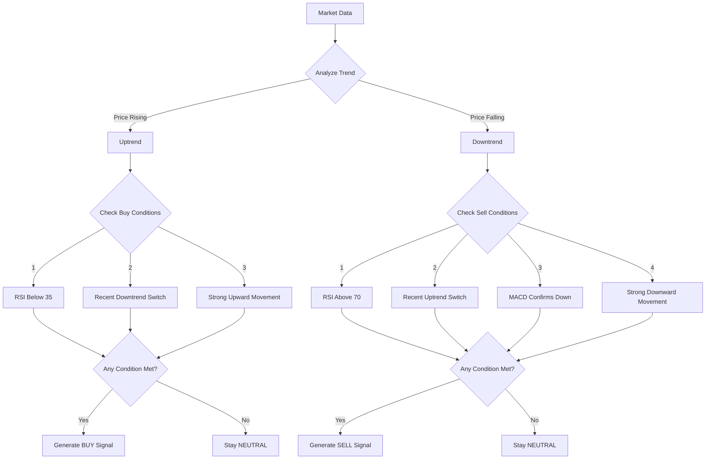

# Trend Detector v2 Gemini - Smart Cryptocurrency Trading Simulator

## What Does It Do?

Trend Detector v2 Gemini is your personal cryptocurrency trading assistant that watches the market 24/7 and helps you understand when might be good times to buy or sell. It's like having an experienced trader who:

- Never sleeps
- Makes decisions based on pure logic, not emotions
- Learns from its past performance
- Keeps detailed records of everything it does

While it's currently in simulation mode (no real trades), it helps you learn and practice trading strategies risk-free.

## Key Features

🔍 **Smart Market Analysis**
- Continuously monitors cryptocurrency prices
- Uses 4 different ways to analyze market movements
- Looks for multiple confirmations before suggesting trades

📈 **Self-Learning Capabilities**
- Adjusts its strategy based on what works
- Gets smarter over time
- Learns from both successes and mistakes

📊 **Detailed Performance Tracking**
- Records every decision it makes
- Shows you why it made each decision
- Helps you understand market patterns

## How It Makes Decisions

## When Does It Buy?

The system looks for any of these situations to consider buying:

1. **Oversold Condition** (RSI < 35)
   - Market might have dropped too far
   - Good potential for a bounce back

2. **Trend Switch**
   - Market just switched from falling to rising
   - Early sign of potential upward movement

3. **Strong Uptrend**
   - Clear upward momentum
   - Fast moving average significantly above slow moving average (>0.5%)

## When Does It Sell?

It considers selling when it sees any of these:

1. **Overbought Condition** (RSI > 70)
   - Market might have risen too far
   - Good time to take profits

2. **Trend Reversal**
   - Market switches from rising to falling
   - Early warning of potential drop

3. **MACD Confirmation**
   - Technical indicator confirms downward momentum
   - Additional verification of selling opportunity

4. **Strong Downtrend**
   - Clear downward momentum
   - Fast moving average significantly below slow moving average (>0.5%)

## Real-World Benefits

✅ **Learn Trading Without Risk**
- Practice trading strategies without using real money
- Understand market patterns and indicators
- Build confidence in trading decisions

✅ **Data-Driven Decisions**
- Remove emotional bias from trading
- Base decisions on mathematical analysis
- Track performance objectively

✅ **Continuous Improvement**
- System learns and adapts over time
- Adjusts to changing market conditions
- Gets better with more data

## Getting Started

1. Set your initial investment amount (default: 500 USDC)
2. Configure risk parameters (optional)
3. Run the script and watch it analyze the market
4. Review the trading log to understand decisions
5. Adjust parameters based on performance

## Safety First

🚨 **Important: This is a SIMULATION tool**
- Does not make real trades
- Perfect for learning and strategy testing
- Use for education and practice only

## Performance Tracking

The system maintains detailed logs of:
- Every trade signal generated
- Market conditions at each decision point
- Portfolio value over time
- Win/loss ratios
- Performance versus "buy and hold"

## Next Steps

1. Start with default settings
2. Monitor performance for a few days
3. Review trading logs to understand decisions
4. Adjust parameters if needed
5. Use insights for your real trading decisions

Remember: This is a learning tool. While it uses sophisticated analysis, cryptocurrency markets are inherently risky. Always do your own research before making real trading decisions.
